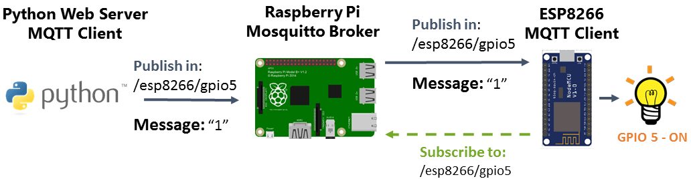

# Projet de surveillance de la qualité de l'air avec Raspberry Pi, ESP32 et MQTT

Ce projet vise à surveiller la qualité de l'air en utilisant un Raspberry Pi, un ESP32 Dev Kit C4 et des capteurs DHT22 et PM2.5. Les données des capteurs sont envoyées à un serveur MQTT pour stockage et traitement ultérieur. De plus, les données sont mises à jour en temps réel sur une interface web utilisant Python Flask et SocketIO.

## Matériel requis
* Raspberry Pi 4
* ESP32 Dev Kit C4
* Capteur de température et d'humidité DHT22
* Capteur de particules PM2.5 SDS011
* Écran LCD avec interface I2C
* Bouton de reset

# Pinout esp32

# Cablage 

# Configuration du projet

Conclusion
Ce projet permet de surveiller la qualité de l'air en temps réel en utilisant des capteurs abordables et un Raspberry Pi. Les données sont stockées sur un serveur MQTT pour un traitement ultérieur et sont affichées en temps réel sur une interface web. Ce projet peut être amélioré en ajoutant d'autres capteurs et en utilisant des techniques d'apprentissage automatique pour détecter les tendances à long terme dans les données.